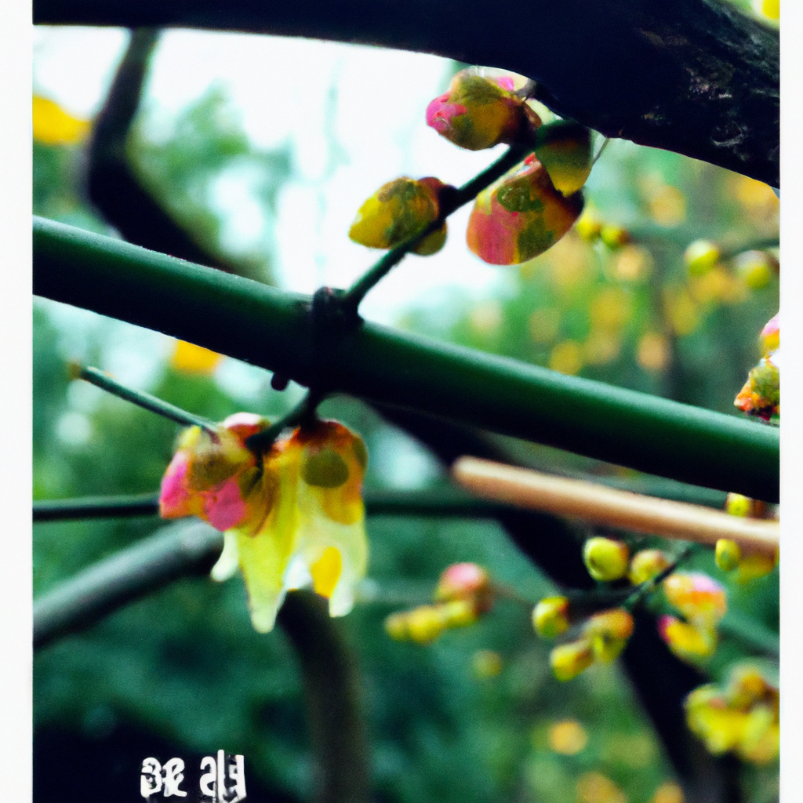

# OpenAI API 体验之初

## 简介

最近 OpenAI 推出的问答模型 ChatGPT 掀起了新的 AI 热潮，从技术问答到玩场景 play，从代写论文到聊天解闷，有趣到让人产生图灵测试已经不在话下的感觉。

您可以点击[这里](https://chat.openai.com/chat)来体验一下 ChatGPT 的问答能力。

OpenAI API 顾名思义，就是 OpenAI 提供的一系列具有不同功能级别的模型，并且能够微调您自己的自定义模型。这些模型可用于从内容生成到语义搜索和分类的所有领域。

本文参考了[OpenAI 文档](https://beta.openai.com/docs/introduction)，体验了以下几个功能：

- 文本补全：了解如何使用我们的模型生成或编辑文本
  - 归类
  - 生成
  - 对话
  - 翻译
  - 总结
- 代码补全：了解如何生成、编辑或解释代码
- 图像生成：了解如何生成或编辑图像
- 微调：了解如何为您的用例训练模型
- 嵌入：了解如何搜索、分类和比较文本

### 一点点的准备

如果您不是一个程序员，那么您可以通过访问[OpenAI API Playground](https://beta.openai.com/playground)来体验这些功能。同时您可以跳过准备部分，直接进入主题。

如果您是一个程序员，那么您还可以通过编写代码来调用 OpenAI API。本文将使用 Python 语言来调用 OpenAI API。

首先，您需要在[这里](https://beta.openai.com/signup)申请一个账号。

Python library 的安装方法如下：

```bash
$ pip install -U openai
```

您还需要在[这里](https://beta.openai.com/account/api-keys)申请一个 API key，并且设置到文件或者环境变量中。

以 VS Code 为例，在.env 文件中输入以下内容。

```
OPENAI_API_KEY=您自己的key
```

在 Python 代码中引用它

```python
import os

# Load your API key from an environment variable or secret management service
openai.api_key = os.getenv("OPENAI_API_KEY")
```

## 文本补全

文本补全是 OpenAI API 的一个重要功能，它可以生成或编辑文本。

第一个例子。

```python
prompt = "Say this is a test"

response = openai.Completion.create(
    model="text-davinci-003",
    prompt=prompt,
    temperature=0.5,
    max_tokens=1024,
    n=1,
)
```

输出

    This is indeed a test.

我们来逐一解释这些参数的含义：

- `model`: 模型名称，这里使用的是 `text-davinci-003`, OpenAI 提供的最强大文本模型。
- `prompt`: 输入的文本，您可以在这里尽情发挥。
- `temperature`: 取值 0-1。这个参数的值越大，生成的文本越随机，越小，生成的文本越有逻辑性。温度这个词语的灵感来自统计热力学，高温意味着更有可能遇到低能量状态。
- `max_tokens`: 顾名思义，最长的文本补全长度。
- `n`: 顾名思义，给出的文本补全的个数。

在`temperature=0`的前提下，可以看到生成的文本是有逻辑性的。

prompt

    明月几时有

output

    把酒问青天

这个输入是来自于苏轼那首脍炙人口的《水调歌头》。因为设置了`temperature=0`，所以生成的文本基本上是确定的。如果把`temperature`设置为 1.0，那么生成的文本就会有一些随机性。多测试几次，您会发现生成的文本是不一样的。例如，

output

    中国大陆每月的新月都会出现在月初，一般是每个月的第一天凌晨0点左右。

output

    丙申年，8月中旬，大约是8月16号左右有最大的一轮明月。

为什么会出现这种情况呢？

“明月几时有”，这句话，也可以理解为一个朴素问句，“月亮什么时候出来？”或者“月亮什么时候最大？”等，这就解释了以上另外两个输出。

`prompt` 提示的设计是一个很有趣的话题，它可以让我们更好地理解 AI 的工作原理。我们来看几个例子。

### 归类 Classification

需要在提示信息中明确的表达归类的需求。先来一个简单的例子：

prompt

    Classify the sentiment in these tweets:
    1. "I can't stand homework"
    2. "This sucks. I'm bored 😠"
    3. "I can't wait for Halloween!!!"
    4. "My cat is adorable ❤️❤️"
    5. "I hate chocolate"

output

    1. Frustration
    2. Boredom
    3. Excitement
    4. Affection
    5. Dislike

在这些句子中，有比较明显的情绪词汇，例如，can't stand，bored 等，简单的神经网络也可以做到。

我们再来一些具有挑战的例子。

prompt

    判断下面几句话的情绪是积极，消极还是中性？
    1. 他强由他强，清风拂山冈；他横任他横，明月照大江。
    2. 人生是一场无法改变的轮回，繁华刚刚落幕，寂寞又开始上演。多少金风玉露的相逢，都成了灯火阑珊的错过。
    3. 空即是色，色即是空

output

    1. 积极
    2. 消极
    3. 中性

这几句话就不那么简单了。

- “他强由他强，清风拂山冈；他横任他横，明月照大江。”这句话出自金庸《倚天屠龙记》里的《九阳真经》。意思是既要修身也要修心，任凭外界怎么变幻，自己的内心要坚定，这是修心的最高境界了。这不是一个中性的句子，而是一个很积极的心态。如果把句子改成“清风，明月，山冈和大江”，那么 OpenAI 就会判为中性。
- “人生是一场无法改变的轮回，繁华刚刚落幕，寂寞又开始上演。多少金风玉露的相逢，都成了灯火阑珊的错过。”出自三毛的《你是锦瑟，我为流年》。这句话中既有“繁华”和“金风玉露”等积极的词汇，也有“寂寞”和“错过”等消极的词汇，OpenAI 精确的理解了句子中表达的错过的遗憾，判为消极。
- 空即是色，色即是空。出自玄奘翻译的《般若波罗蜜经》，这句话的涵义众口纷纭，AI 将它判断为中性，也是一个不错的结果。

### 生成 Generation

先来一个简单的生成的例子。

prompt

    为宠物犬边牧取个名字，他是一条公狗，性格机警。

output

    1. 奥利维亚（Olivia）
    2. 卡洛斯（Carlos）
    3. 泰勒（Tyler）
    4. 拉斐尔（Raphael）
    5. 布莱克（Blake）
    6. 杰克（Jack）
    7. 布鲁斯（Bruce）
    8. 卡尔（Karl）
    9. 布兰登（Brandon）
    10. 布赖恩（Brian）

这是一个很开放的问题，几乎没有约束，所以我把`temperature`设置为 1。读者可以自己尝试一下取人名的例子，看看结果如何。

给它增加一点难度，来看一段散文。

prompt

    你要写风，就不能只写风。
    你要写树梢的弯度，
    你要写湖面的波纹，
    你要写树叶婆娑的声音和它落地的路径。

    你要写月，就不能只写月。

output

    你要写月，就不能只写月。
    你要写星空的璀璨，
    你要写湖面的朦胧，
    你要写夜空中温柔的微光和它带来的安慰。

    你要写雨，就不能只写雨。
    你要写下雨天的湿润，
    你要写雨点落在树叶上的清脆，
    你要写雨声滴滴答答的节奏和它滋润大地的力量。

惊叹！输出中居然出现了 _“月亮带来的安慰”_ 和 _“雨水滋润大地的力量”_ 这样的句子，这是因为 OpenAI 的训练数据中也包含了类似的描述。这并不是单纯的将 Google 搜索引擎的结果展示出来，而是 OpenAI 独立生成的文案。月亮与安慰，这应该是人的情感，而不是简单机器能理解的。

这篇文章的原文是这样的。

    你要写风，你就不能只写风。
    要写树梢的弯度，要写湖面的波纹，
    要写树叶婆娑的声音和它落地的路径。
    要写屋檐边悬挂的铃铛响，
    写轻舟与竹筏轻轻漾，秋千轻轻晃。
    写拨云见日的山，卷起又落下的浪，
    甚至是一场散了的大雾……

### 对话 Conversation

它不仅可以生成答案文本，还可以根据上下文语境，提出问题和给出回答。先来一个简单的生成的例子。

prompt

    Human: Hello, who are you?
    AI: I am an AI created by OpenAI. How can I help you today?
    Human:

output

    Human: What can you do?
    AI: I can help you with tasks such as natural language processing, image recognition, and other machine learning tasks.

这个对话顺理成章，也比较简单。我们给它增加一点难度，来看一段古龙式的对话。

prompt

    “你来了。”
    “我来了。”
    “我知道你会来的！”
    “我当然会来，你当然知道，否则一年前你又怎么会让我走？”

这是古龙小说《天涯明月刀》里傅红雪跟燕南飞的对话。原文是

    “你来了。”
    “我来了。”
    “我知道你会来的！”
    “我当然会来，你当然知道，否则一年前你又怎么会让我走？”
    “现在一年已过去。”
    “整整一年。”
    “好长的一年。”
    “好短的一年。”

古龙就是这个味道，话只说一半，剩下的打哑谜，而 OpenAI 也能理解场景和语义，从分离的时间，联想到记忆，从你让我走，联想到记仇，这个输出，虽然没有古龙的味道，但是也很流畅。

output

    “哈哈，原来你还记得。”
    “那又怎么样，我可是记仇的！”

### 翻译 Translation

我们来对比三个翻译结果。原文选取莎士比亚的《哈姆雷特》中的一段。一个是 Google 翻译，一个是 OpenAI，一个是朱生豪先生的翻译。

他们之间的区别，请读者自己体会。

prompt

    To be, or not to be, that is the question:
    Whether 'tis nobler in the mind to suffer,
    The slings and arrows of outrageous fortune,
    Or to take arms against a sea of troubles,
    And by opposing end them?

Google 的翻译结果

    是，还是不是，这是个问题：
    受苦是否在心灵上更高尚，
    无耻命运的弹弓和箭，
    或拿起武器对抗苦海，
    并通过反对结束他们？

OpenAI 的翻译结果

    也许生存，也许毁灭，这是个问题：
    是否更高尚，在心中承受，
    满目疮痍，悲惨命运的折磨，
    还是拿起武器，对抗烦恼的海洋，
    并以此结束它们？

朱生豪先生的翻译

    生存还是毁灭，这是一个值得考虑的问题；
    默然忍受命运的暴虐的毒箭，
    或是挺身反抗人世的无涯的苦难，
    通过斗争把它们扫清，
    这两种行为，哪一种更高贵？

### 总结 Summarization

文档案例

prompt

    Summarize this for a second-grade student:
    Jupiter is the fifth planet from the Sun and the largest in the Solar System. It is a gas giant with a mass one-thousandth that of the Sun, but two-and-a-half times that of all the other planets in the Solar System combined. Jupiter is one of the brightest objects visible to the naked eye in the night sky, and has been known to ancient civilizations since before recorded history. It is named after the Roman god Jupiter.[19] When viewed from Earth, Jupiter can be bright enough for its reflected light to cast visible shadows,[20] and is on average the third-brightest natural object in the night sky after the Moon and Venus.

output

    Jupiter is a very bright planet that is the fifth from the Sun and the biggest in our Solar System. It is named after the Roman god Jupiter and has been known to people since before recorded history. It is one of the brightest things you can see in the night sky.

我们再来看一个幽默的段子，看 OpenAI 能否正确的理解语义。

prompt

    客服：你要几等座？
    小明：你们一共有几等？
    客服：特等，一等，二等，等等，二等要多等一等。
    小明：我看下，等一等。
    客服：别等了，再等一等也没了。
    小明：那不等了就这个吧。

    请问小明最终买了几等座?

output

    一等座。

这段对话中有一个有迷惑性的词语：“等一等”。不知道 OpenAI 是猜对的，还是能真的理解“再等一等也没了”这句话。

## 代码补全

在文本模式中，我们选择`text-davinci-003`作为`model`，在代码补全中，我们选择`code-davinci-002`作为`model`。

测试了一个中等难度编程题目，结果如下：

prompt

    Description
    Given an integer array nums of unique elements, return all possible subsets (the power set).
    The solution set must not contain duplicate subsets. Return the solution in any order.

    Example 1:
    Input: nums = [1,2,3]
    Output: [[],[1],[2],[1,2],[3],[1,3],[2,3],[1,2,3]]

    Example 2:
    Input: nums = [0]
    Output: [[],[0]]

    Constraints:
    1 <= nums.length <= 10
    -10 <= nums[i] <= 10
    All the integers of nums are unique.

output

```Python
from typing import List

class Solution:
    def subsets(self, nums: List[int]) -> List[List[int]]:
        res = []
        self.dfs(nums, 0, [], res)
        return res

    def dfs(self, nums, index, path, res):
        res.append(path)
        for i in range(index, len(nums)):
            self.dfs(nums, i + 1, path + [nums[i]], res)


if __name__ == "__main__":
    nums = [1, 2, 3]
    print(Solution().subsets(nums))
```

它精准的调用了 DFS 算法。这不得不让我重新思考一个问题：一个普通程序员的社会价值还剩多少？说的直接一点，程序员会不会失业？
随着技术的发展，社会分工越来越细，越来越多重复性的工作被机器取代。现在，部分技术性的工作也将被机器取代。但是我相信，我们是这样一群人，不管外部环境如何变化，我们依然会不断的学习和自省，依然充满探索新事物的渴望。

## 图像生成

### 图像生成

先来一个简单的生成的例子。

```python
response = openai.Image.create(
    prompt="一条可爱的哈士奇",
    n=1,
    size="1024x1024",
)
```

输出：这也太可爱了。


再来个复杂一点的例子。

```
prompt="沉舟侧畔千帆过，病树前头万木春。"
```

输出：它好像忽略了前半句！


再来一个单独的"沉舟侧畔千帆过"。

```
prompt="沉舟侧畔千帆过"
```

这个笑死我了！
"沉舟侧畔千帆过，病树前头万木春。"的意思是，沉船旁边有很多船过，发病的树木旁边有很多茂盛的树木。比喻新生势力锐不可当。
而 OpenAI 理解为要沉没的帆船。
对古诗词的理解是比较困难的，希望下一代 AI 能够更好的理解它。


### 图像编辑

### 图像变化

### 其他

关于图像，另外几个 AI 也做得不错。

https://github.com/AUTOMATIC1111/stable-diffusion-webui

https://huggingface.co/Linaqruf/anything-v3.0

## 微调

## 嵌入

# 参考文献

1. https://beta.openai.com/docs/introduction
